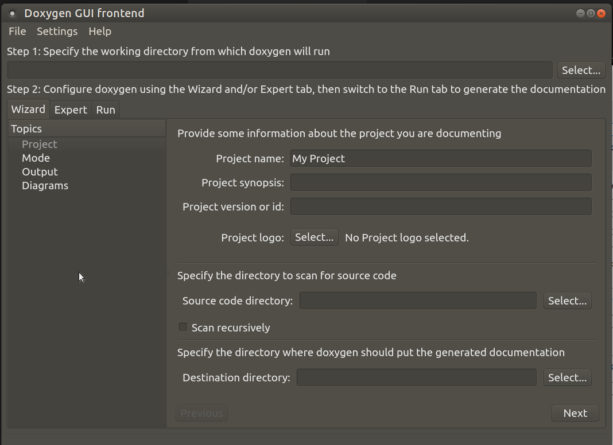
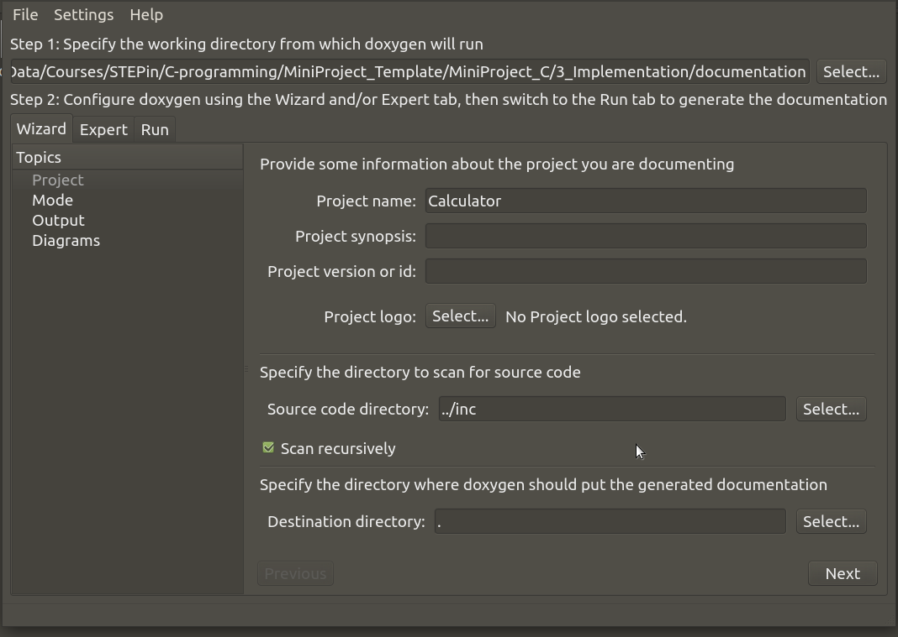
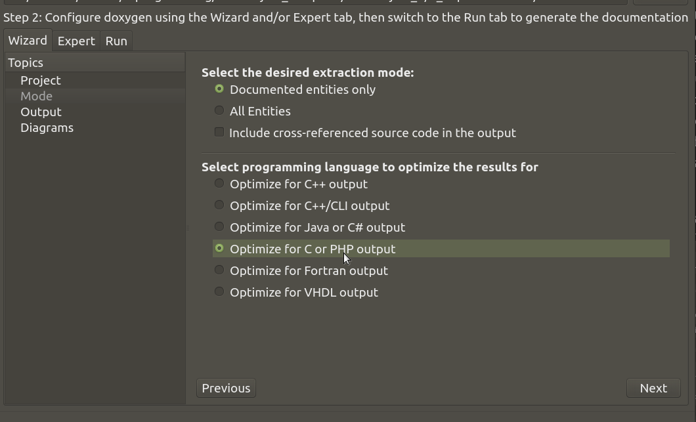
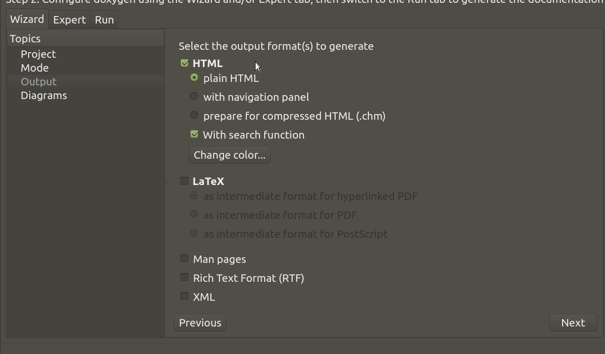
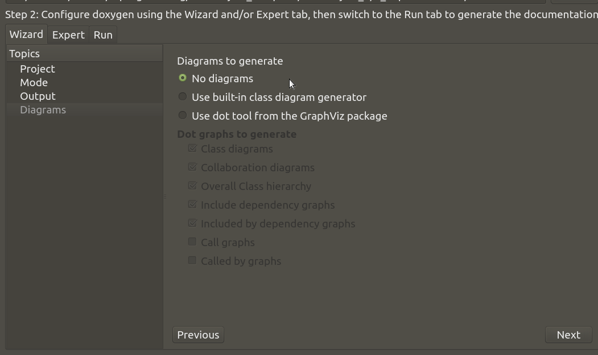
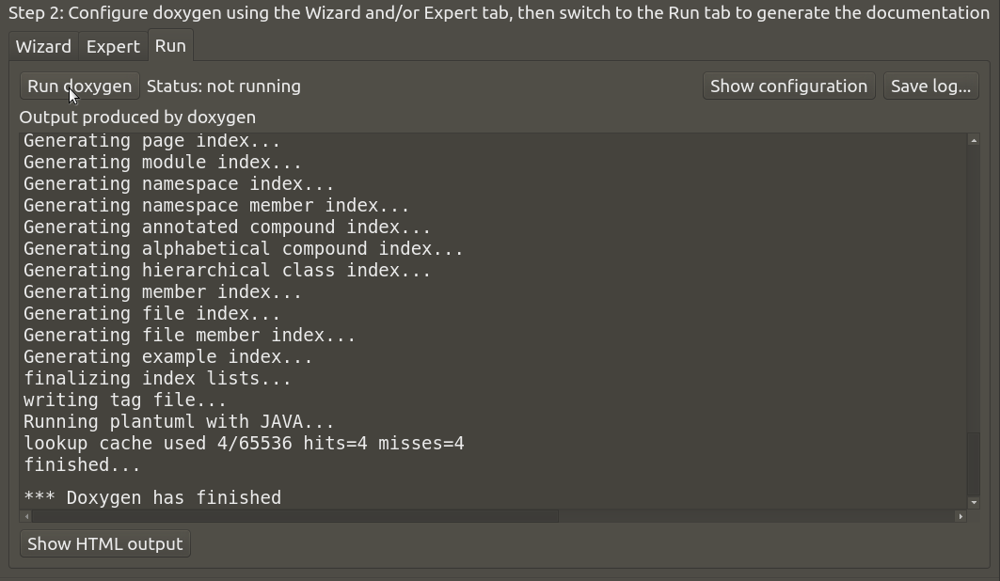
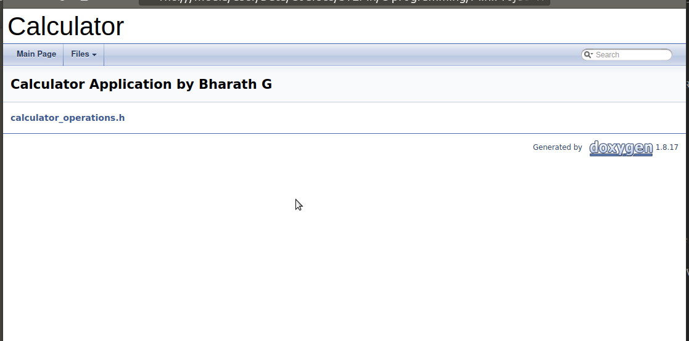
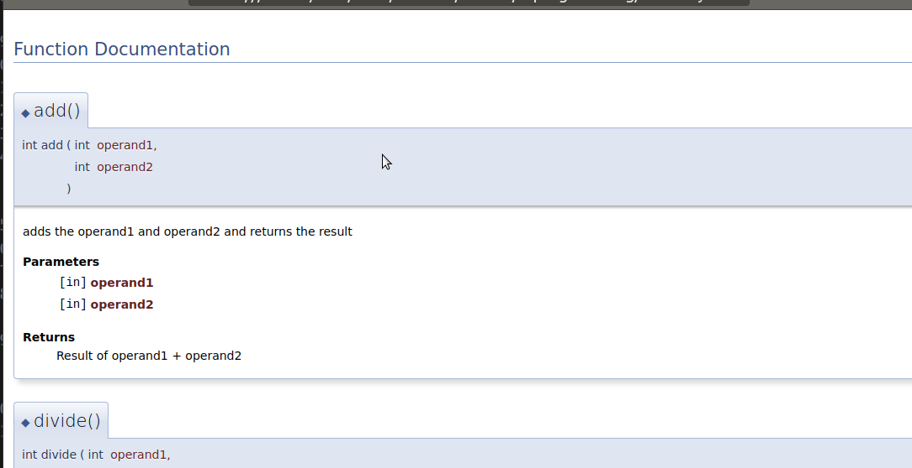

# Code Documentation using Doxygen based comments
## Step-1: Create files
* Create a two new folders **documentation** and **inc** under your project
* Create a file named **documentation_main.md** inside **inc** folder
```
	@mainpage Calculator Application by "Your name"
	@subpage calculator_operations.h
```

* Create **calculator_operations.h** file with below content under **inc** folder
```
/**
 * @file calculator_operations.h
 * @author Your Name
 * @brief Header file for Calculator application with Arithmetic operations
 *
 */

#ifndef __CALCULATOR_OPERATIONS_H__
#define __CALCULATOR_OPERATIONS_H__

#include <stdio.h>
#include <stdlib.h>

/**
* @brief Adds the operand1 and operand2 and returns the result
* @param[in] operand1 
* @param[in] operand2 
* @return Result of operand1 + operand2
*/
int add(int operand1, int operand2);

/**
* @brief Subtracts the operand1, operand2 and returns the result
* @param[in] operand1 
* @param[in] operand2 
* @return Result of operand1 - operand2
*/
int subtract(int operand1, int operand2);

/**
* @brief Multiply the operand1, operand2 and returns the result
* @param[in] operand1 
* @param[in] operand2 
* @return Result of operand1 * operand2
*/
int multiply(int operand1, int operand2);

/**
* @brief Divides the operand1 by operand2 and returns the result 
* @param[in] operand1 
* @param[in] operand2 
* @return integer value of the operand1 / operand2
* @note returns 0 for divide by 0 error
*/
int divide(int operand1, int operand2);

#endif  /* #define __CALCULATOR_OPERATIONS_H__ */
```
## Step-2: Create Doxyfile
### Launch Doxywizard 
* If not already installed Doxygen, install based on your OS: [Windows](https://github.com/stepin654321/MiniProject_Template/wiki/Windows_Setup#documentation), [Linux](https://github.com/stepin654321/MiniProject_Template/wiki/Linux_Setup#documentation)

#### Windows OS
|Step-1|Step-2|
|:--:|:--:|
|||

#### Linux OS
* Type the below command
```
    doxywizard
```
|Step-1|
|:--:|
||

### Creating Doxygen file
* Change the Project name to "Calculator".
* Save the file as **Calculator_Doxyfile** under your project's **documentation** folder
```
    File -> Save -> Path
```
* Folder structure should now look like this
```
    Project
        documentation
            Calculator_Doxfile
        inc
            calculator_operations.h
            documentation_main.md
```
## Step-3: Configure the Doxyfile
### Setup Paths
* Specify **Source code directory**. Select the folder where header files with doxygen comments are placed.
    * We placed the header file in **inc**
* Select the option **Scan recursively** 
    * To include any sub folders for documentation
* Select the **Destination directory** where all the documents must be placed. In our case it is the current folder where Doxyfile is placed.
* **Save** and click on **Next**

|Setup Paths|
|:--:|
||

### Setup Mode
* Change the Optimization method to C
* **Save** and click on **Next**

|Setup Mode|
|:--:|
||

### Setup Output
* Select the mode as **HTML** only
* And click on **Next**

|Setup Output|
|:--:|
||

### Setup Diagrams
* Select **No Diagrams**
* **Save** and click on **Next**

|Setup Diagrams|
|:--:|
||

## Step-4: Generate Documents
* Click **Run doxygen** and check that it is finished without errors.
* **Save** the changes done sar far
```
    File -> Save
```

|Generate Documents|
|:--:|
||

## Step-5: View Generated Documents
* Click **Show HTML Output** to view genrated files in browser.
* All the files generated by Doxygen are placed under **documentation/html** folder.
* To view the documentation, one can open **index.html** file.

* Click on **calculator_operations.h** to view docuemnts for functions.

|Main Page|Subpage|
|:--:|:--:|
|||

## Step-6: Learning more about Doxygen
* To understand each option of Doxygen Follow this [Tutorial1](https://embeddedinventor.com/guide-to-configure-doxygen-to-document-c-source-code-for-beginners/) and [Tutorial2](https://os.mbed.com/media/uploads/defiantgti/doxygentutorial.pdf)

# Notes
* For generating the cdocuemnts after some changes or additions, we can reuse the generated **Calculator_Doxyfile** by opening it from Doxywizard application
```
    File-> Open
```
