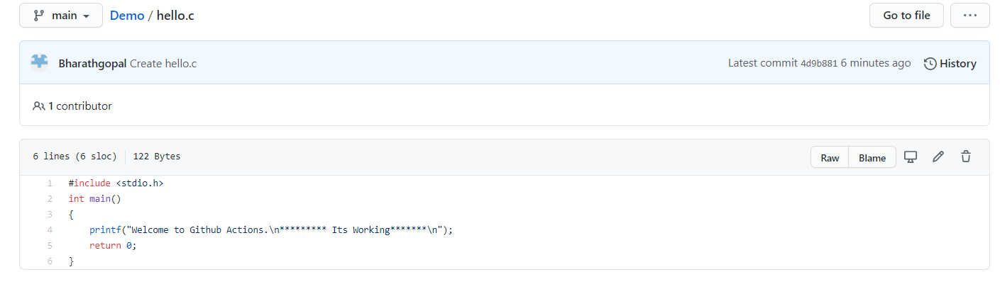
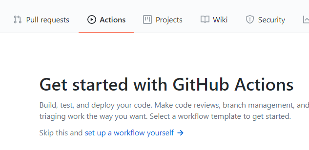
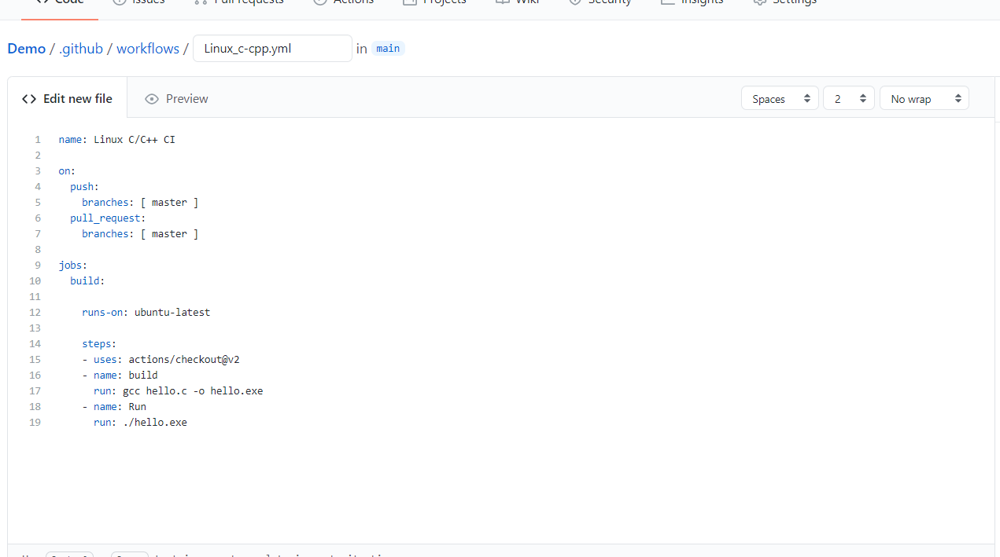
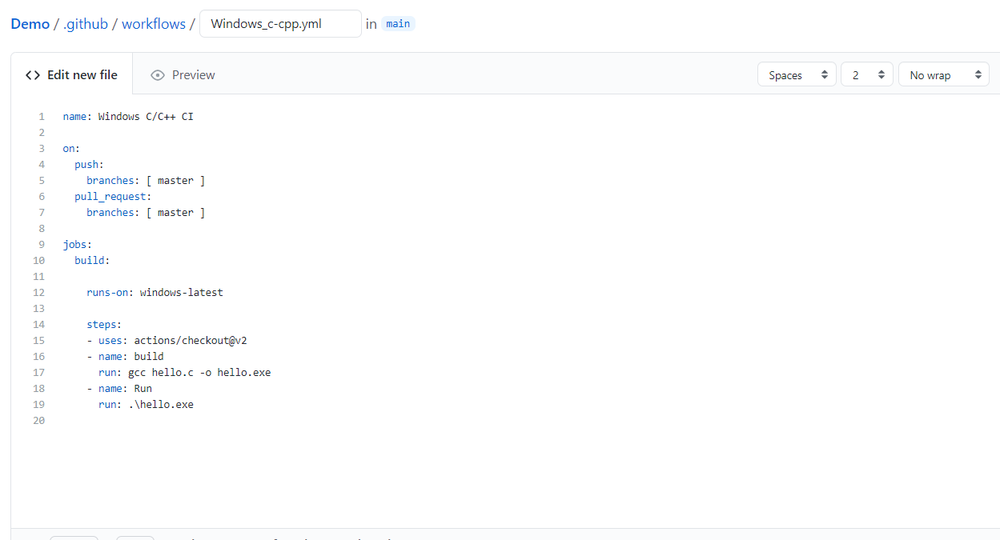
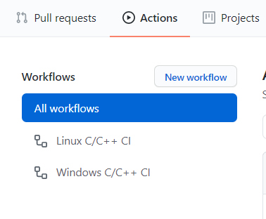
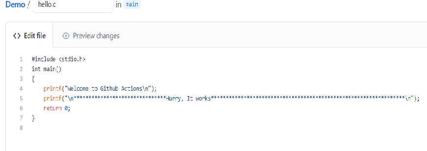
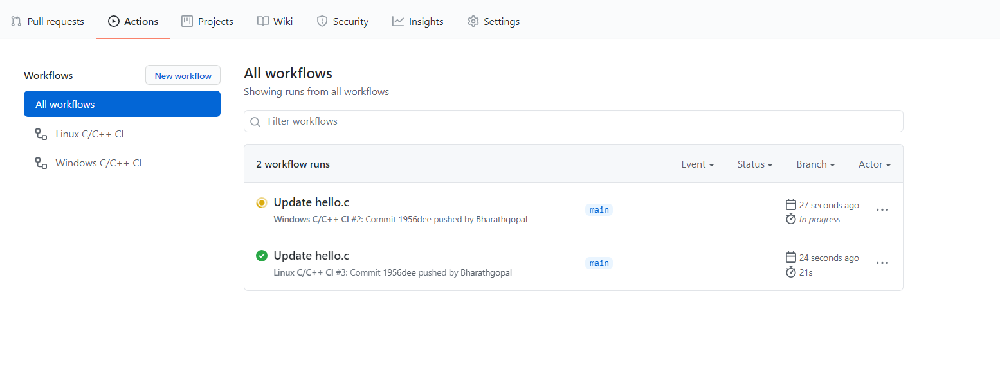
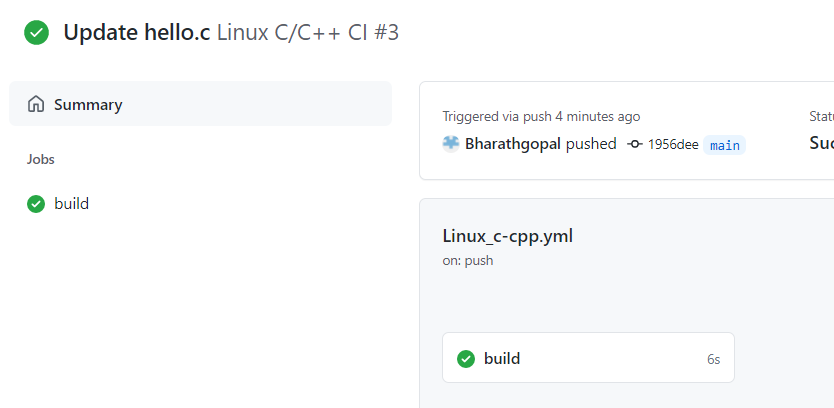
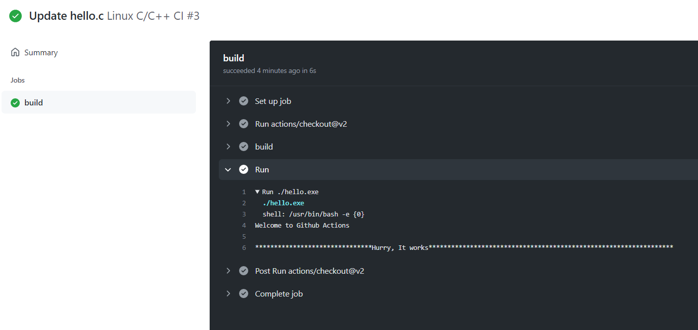

# Setup a GitHub workflow for Windows and Linux OS

* Create a file hello.c with below content and add to the repository
```
#include <stdio.h>
int main()
{
    printf("Welcome to Github Actions.\n********* Its Working*******\n");
    return 0;
}
```

|Preparation|
|:--:|
||


* In the repository, click on **Actions** tab and create a new workflow either from existing or a new workflow.

|Create actions|
|:--:|
||

## Build action for Linux OS

* Add the below content into the **.yml** file and commit to repository
```
name: Linux C/C++ CI

on:
  push:
    branches: [ master ]
  pull_request:
    branches: [ master ]

jobs:
  build:

    runs-on: ubuntu-latest

    steps:
    - uses: actions/checkout@v2
    - name: build
      run: gcc hello.c -o hello.exe
    - name: Run
      run: ./hello.exe
```

|Work flow for Linux|
|:--:|
||

## Build action for Windows OS
* Add the below content into the **.yml** file and commit to repository
```
name: Windows C/C++ CI

on:
  push:
    branches: [ master ]
  pull_request:
    branches: [ master ]

jobs:
  build:

    runs-on: windows-latest

    steps:
    - uses: actions/checkout@v2
    - name: build
      run: gcc hello.c -o hello.exe
    - name: Run
      run: .\hello.exe
```

|Work flow for Windows|
|:--:|
||


* Verify that the files you created are under the path **your_repo_name**/.github/workflows
* Also click on **Actions** tab and verify that the newly added actions are present.

|Verification||
|:--:|:--:|
|||

* Make a small change to the **hello.c** file and **commit** changes to trigger the build actions.
```
#include <stdio.h>
int main()
{
    printf("Welcome to Github Actions\n");
    printf("\n******Hurry, It works******\n");
    return 0;
}

```

|Triggering Workflow|
|:--:|
||

### Verify that the actions are triggered and build is successful
* Under **Actions** tab, check that the build works are triggered and wait for them to complete.
* When color changes to **Green** (Build is successful) or **Red** (Build is failing) its complete.
* Now open any one action and verify if you got the expected outputunder the **Run** command.
* Click on any Workflow, and select **build** on the left side and expand teh **Run** command and check that the output is printed.

|Workflow in action||
|:--:|:--:|
|||

|Workflow Output|
|:--:|
||


* The build and run commands can be replaced with Makefile commands to setup the build actions for projects with Makefiles
