# Setup VS code to Clone and Push from Github Repositories
## Step-1
* Create an Account on Github if you dont have an account already.

## Step-2
* If you already have a repository created, jump to [Step-3](#step-3)
* Create a new repository
* Use available and meaningful name for your repository
* Select appropriate visibility for your repository. Public to make it visilble for everyone on the internet. Private to make it visible only for you and contributors you add to your repository.
* Add the **README .md** and **.gitignore** files
* Verify that the files are visible under your repository.

|Step1|Step2|
|:--:|:--:|
|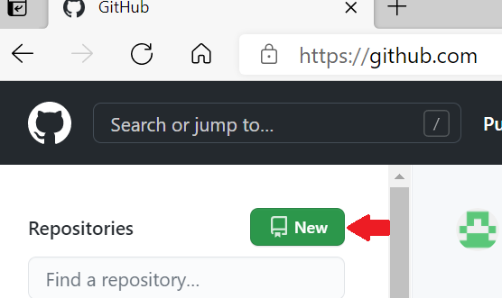|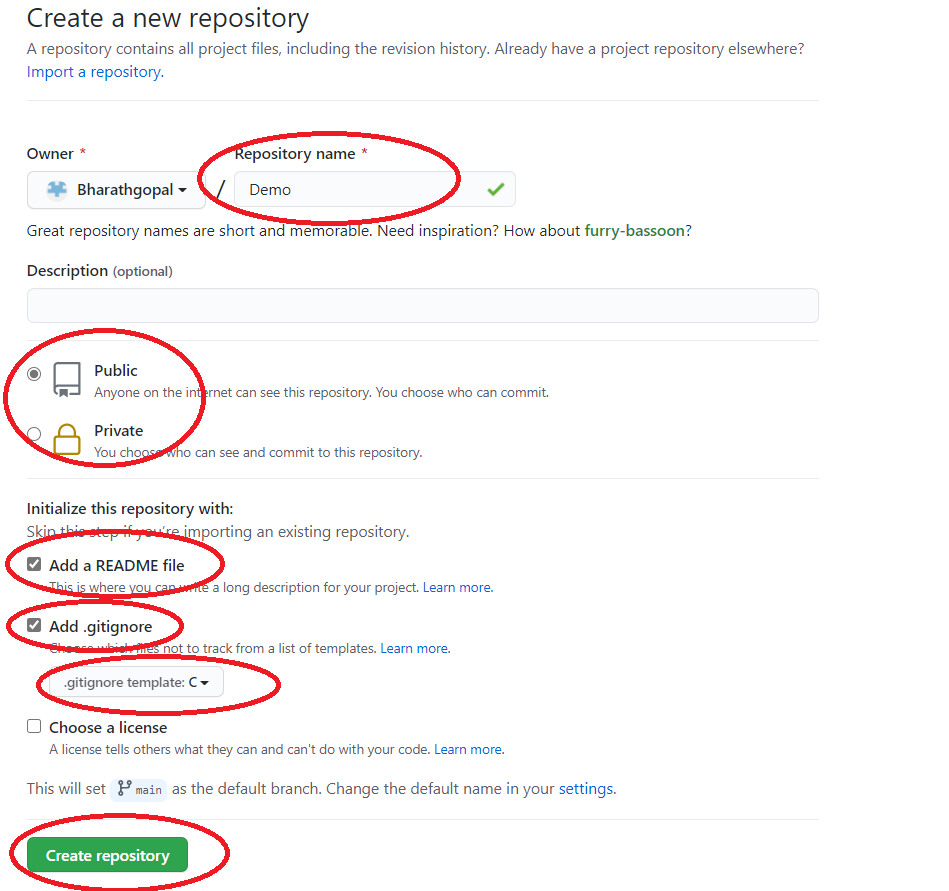|

|Step3|
|:--:|
|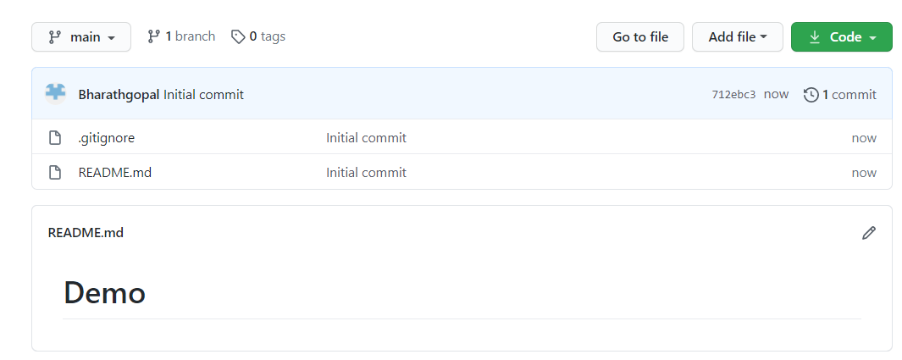|

## Step-3
* Clone your Repository to your local machine through VS Code
* Copy the Https link of your github repository
* Use **CTRL + SHIFt + P** to open command pallette and type **clone** and select **Clone from GitHub**
* Paste the copied Https link and click Enter
* Select a location where the repository should be saved on the machine
* Select **Open** option to open the Cloned Repository in VS Code
* Check that the contents of the repository are shown in the VS Code

|Step1|Step2|Step3|
|:--:|:--:|:--:|
|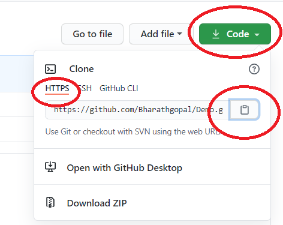|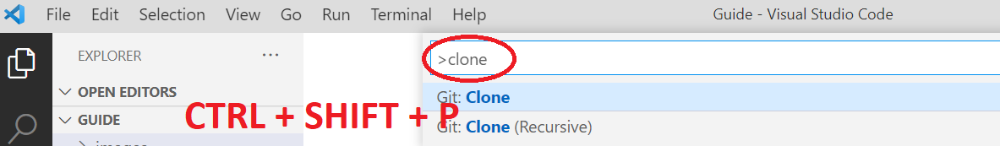|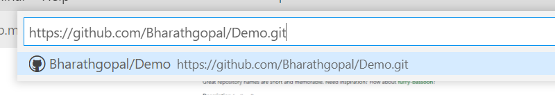|

|Step4|Step5|Step6|
|:--:|:--:|:--:|
||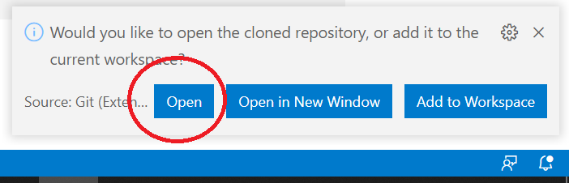|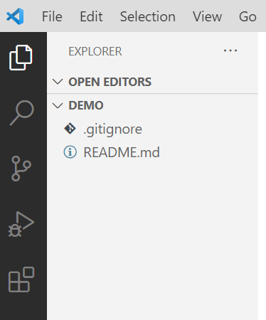|

## Step-4
* Create a new file under the VS Code
* Select the Source control Menu on the Left 
* Add your new files to the [**staging area**](https://git-scm.com/about/staging-area#:~:text=Staging%20Area%20Unlike%20the%20other%20systems%2C%20Git%20has,be%20formatted%20and%20reviewed%20before%20completing%20the%20commit.) by clicking on **+** icon
* Add a meaningful commit message according to the changes made and add to repository by cliking on **&#x2611;**
* From the dropdown, select push to push your local changes to the Github repository.
* On compkletion, refresh the explorer and verify the added fiels are visible.

|Step1|Step2|Step3|
|:--:|:--:|:--:|
|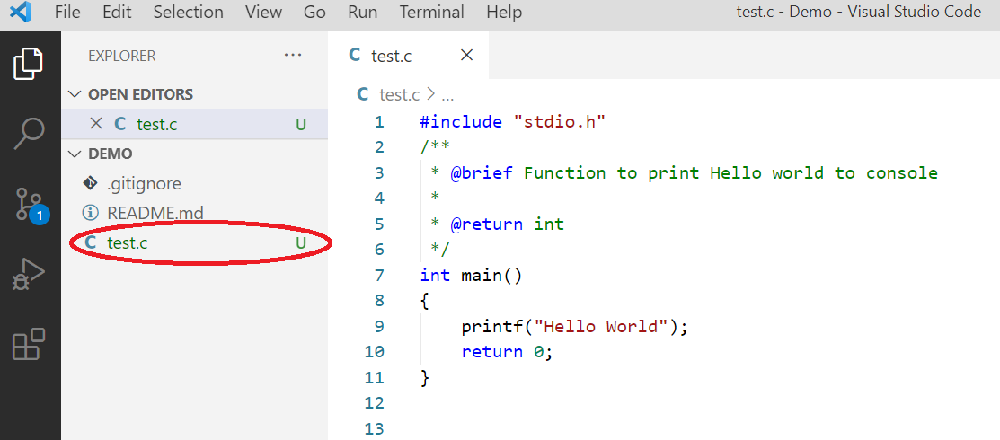|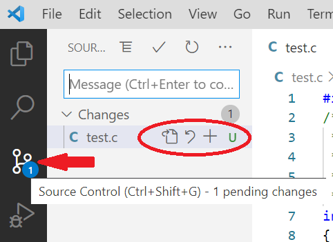|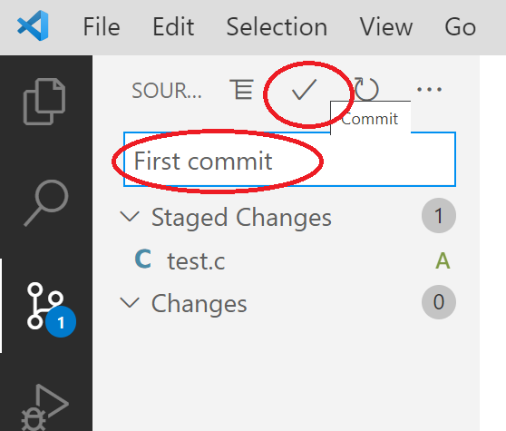|

|Step4|Step5|
|:--:|:--:|
|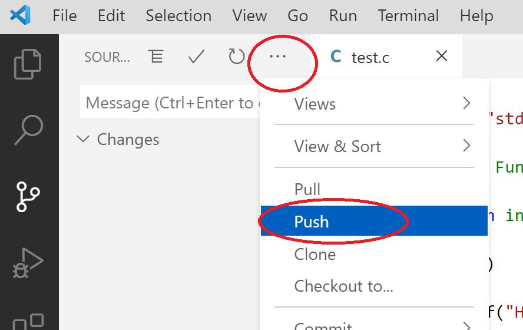|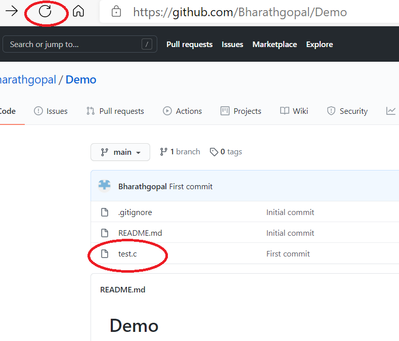|
