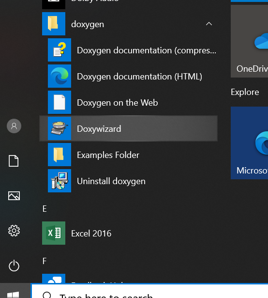
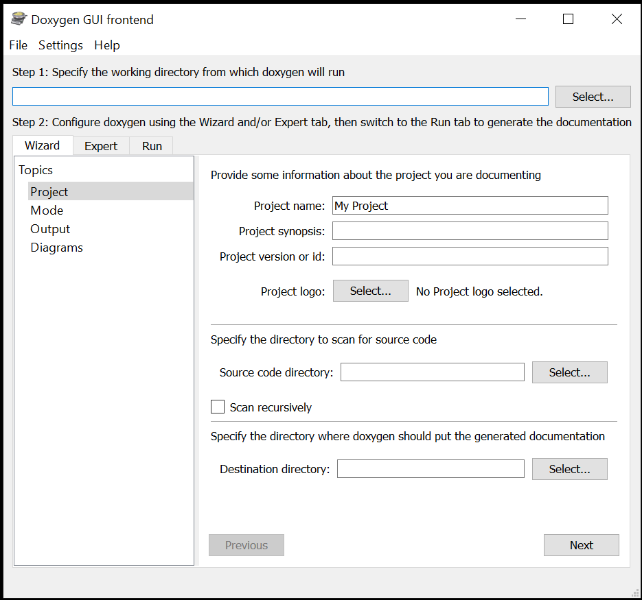

# HOW TO ??

## STEP1 - Create new C Project in Codeblocks
* [New C Project in Codeblocks](https://www.youtube.com/watch?v=c9WT8revSJY)
* From file explorer, Naviagete to Location of your Project and Create a folder named "src", "inc".
* Under "src" folder, create a new file named "sum.c" and add the below code
```
	int sum(int number1, int number2)
	{
		return number1 + number2;
	}
```
* Under "inc" folder, create a new file "sum.h" and add the below code
```
	#ifndef __SUM_H__
	#define __SUM_H__

	int sum(int number1, int number2);

	#endif
```
* Now call your sum function inside the main.c file.
```
	#include <stdio.h>
	#include <stdlib.h>
	#include "sum.h"					/* Add include file*/
	int main()
	{
    	printf("Hello world!\n");

		int my_sum = sum(10, 20);					/* Add function call */
		printf("Sum = %d", my_sum);
    	
		return 0;
	}
```
* After this step you should have the below folders and files under your project folder
```
ProjectFolder
	projectname.cbp
	main.c
	src
		sum.c
	inc
		sum.h
```
* Compiling the project now will give a error at this stage as the sum function is not defined in our project and is not visible to compiler.

## STEP2 - Add Files, Paths and Compile your Project
* Add sum.c file to your project in Code Blocks.
```
	Click on Project --> Add Files --> Navigate to your Project Location --> src --> sum.c
```
* Add include path of header file
```
	Click on Project -> Build options... -> Search directories -> Compiler
	Click on Add Button and Select Navigate and navigate to project folder and select "inc" folder.
	Click on Select Folder.
	Pop up will appear asking to keep this as relative path. Select "Yes" followed by "OK".
	Select OK to Close the Project Build options window.
```
* Compiling your code now shoul dnot give you any error. If there is a error, try to redo the STE2.
* Run the code to confirm your project is configured correctly.

## STEP3 - Add Unity Test framework to Codeblocks
* In file explorer, create new folders "unity" and "test" under your Project folder.
* After this step you should have the below folders and files under your project folder
```
ProjectFolder
	projectname.cbp
	main.c
	src
		sum.c
	inc
		sum.h
	unity
	test
```
* [Download](https://github.com/ThrowTheSwitch/Unity/archive/master.zip) or clone the content from [Unity Thow Swicth](https://github.com/ThrowTheSwitch/Unity)
* Only 3 files are required and are placed inside "src" folder of the downloaded content:
	* unity.c
	* unity.h
	* unity_internals.h
* Copy those files to a folder named "unity" under your project folder which is created in the previous step.

* Under "test" folder, create a new file "test_sum.c" and add the below code
```
	#include "unity.h"
	#include "factorial.h"

	void setUp()
	{	}
	void tearDown()
	{	}
	
	void test_sum(void)
	{
  		TEST_ASSERT_EQUAL(30, sum(10, 20));
  		TEST_ASSERT_EQUAL(-30, sum(-50, 20));
	}

	int test_main(void)
	{
	  	UNITY_BEGIN();
  	
	  	RUN_TEST(test_sum);

  		return UNITY_END();
	}
```
* Under "test" folder, create a new file "test_sum.h" and add the below code
```
	#ifndef __TEST_SUM_H__
	#define __TEST_SUM_H__

	int test_main(void);

	#endif 
```
* Follow STEP2 again to add the "test_sum.c" file to project and "test" folder for including the test folder.
* Add the below code to your "main.c" file
```
	#include <stdio.h>
	#include <stdlib.h>
	#include "sum.h"					/* Add include file*/
	#include "test_sum.h"				/* Add include file*/
	int main()
	{
    	printf("Hello world!\n");

		int my_sum = sum(10, 20);					/* Add function call */
		printf("Sum = %d", my_sum);

		/* Calling test main*/
    	test_main();								/* Add function call */

		return 0;
	}
```
* Compile the code to make sure you have added files and path correctly. If the compilation is giving an error, follow STEP3 again.
* Run the compiled code now to see the output 
```
	test/test_sum.c:10:test_Factorial:PASS
```
* The line number might vary depending on the code. But observe that our code is passing the test case.
* Now add more test cases to test your sum function and observe the output. 
* Try generating a dummy FAIL case by expecting a wrong result from sum function.

* If you have correctly got the ouput so far, you have learnt how to use Unit test framework for C Programming.
* To write and test other projects or programs, you have to change contents from "src", "inc" and "test" folders.
* The content of unity folder will remain same for all projects.

## STEP4 - Generate Documents for projects using Doxygen
* Let us re-use the same project file from the "factorail example" for Doxygen.
* Create a new folder "documentation" under your project, and copy the "Doxyfile" from factorial example.
* Copy files from the Factorial example
```
	Copy "Factorial --> documentation --> Doxyfile"  to "YourProject --> documentation"
	Copy "Factorial --> inc --> documentation_main.md"  to "YourProject --> inc"
```
* Change the Content of documentation_main.md to match your project
```
	@mainpage Sum Application by "Your name"
	@subpage sum.h
```

* Change the content of "sum.h" file to the below
```
	/**
	* @file sum.h
	*/
	#ifndef __SUM_H__
	#define __SUM_H__

	/**
	* Calculates the sum of two integer numbers
	* @param[in] number1 first integer
	* @param[in] number2 seconf integer
	* @return Sum of number1 & number1
	* @note Any note for the function
	*/
	int sum(int number1, int number2);

	#endif 
```


* Launch Doxywizard from launch menu

|Step-1|Step-2|
|:--:|:--:|
|||

* Open the Doxyfile in the Doxywizard application
```
	Click on File --> Open --> Navigate to your project --> documentation --> Doxyfile
```
* Change the Project name to "SUM".
* Since all the configuration is already present, you can genearet the document by clicking on Run
```
	Click on Run --> Run doxygen
```
* The above action should genearet a folder name html under you Project directory. 
* You can Navigate to the folder and launch "index.html" fiel to see the Documentation for your project.

* To understand each option of Doxygen Follow this [Tutorial1](https://embeddedinventor.com/guide-to-configure-doxygen-to-document-c-source-code-for-beginners/) and [Tutorial2](https://os.mbed.com/media/uploads/defiantgti/doxygentutorial.pdf)
